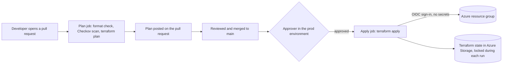

# Azure infrastructure pipeline with no stored passwords

This project builds Azure infrastructure with Terraform through a GitHub Actions pipeline that never stores a password or key anywhere. Changes are previewed on every pull request, production changes wait for a person to approve them, and manual changes made outside the pipeline can be detected and reversed.

It is a hands-on lab I built to practise the delivery patterns used in regulated environments such as banks. All Azure resources were deleted after the lab.

## What it shows

| Practice | How this project does it |
| --- | --- |
| No stored secrets | GitHub signs in to Azure with OIDC (OpenID Connect) workload identity federation. Each run gets a short-lived token; nothing long-lived is saved in GitHub. |
| Least privilege | The pipeline's identity can only build inside one resource group, and can only read and write the Terraform state file, not change the storage account itself. |
| Review before change | Every pull request runs a format check, a security scan (Checkov), and `terraform plan`. The plan is posted as a comment so reviewers see exactly what will change. |
| Human approval for production | Merging to `main` starts the apply job, which waits in a protected `prod` environment until an approver says yes. |
| Safe shared state | Terraform state lives in Azure Storage with no account keys, Entra ID sign-in only, versioning turned on, and a lock so only one run can change it at a time. |
| One run at a time | A GitHub Actions concurrency group stops two pipeline runs from changing the same environment together. |
| Drift detection | A manual plan run shows when someone has changed Azure by hand, and the Azure Activity Log shows who did it and when. |

## How it works

1. A change to the Terraform files is made on a branch and opened as a pull request.
2. The pipeline signs in to Azure with OIDC, then checks formatting, scans for security issues, and runs `terraform plan`. The plan is posted on the pull request.
3. After review, the pull request is merged into `main`.
4. The apply job pauses until someone approves it in the `prod` environment.
5. Once approved, Terraform applies the change and releases the state lock.

## What gets built

All of these are free Azure resources:

1. A virtual network (`10.20.0.0/16`) with two subnets
2. A network security group that blocks all inbound traffic from the internet, attached to the app subnet
3. A user assigned managed identity for a future application
4. Tags on every resource showing the project, the owner, and that Terraform manages it

## Repository layout

| File | Purpose |
| --- | --- |
| `providers.tf` | The Azure provider and the remote state settings |
| `main.tf` | The network, security group and identity |
| `outputs.tf` | Values printed after each apply |
| `.github/workflows/terraform.yml` | The pipeline: plan on pull requests, apply on merge with approval |

## Things I broke on purpose, and what I learned

1. **Sign-in subject mismatch.** The apply job runs in the `prod` environment, which changes the identity GitHub presents to Azure. Without a matching federated credential, Azure rejected it with `AADSTS700213: No matching federated identity record found`. The fix was a federated credential for the environment's subject.
2. **GitHub's subject format includes ID numbers.** The error showed that the subject included the account and repository ID numbers as well as their names. Credentials written from documentation, using names only, did not match. The lesson: always copy the subject from the error message rather than writing it from memory.
3. **Manual changes cause drift.** I added an inbound SSH rule by hand. A plan run showed Terraform wanted to remove it, the Activity Log showed my account made the change, and re-running the apply put the security group back as defined in code. Every Terraform change in the log appeared under the pipeline's identity, so a change by any other identity stood out immediately.

## What I would add for production

1. **Private networking.** Make the state storage and other services private-only, and run the pipeline on self-hosted runners inside the network.
2. **Azure Policy.** Deny public endpoints and inbound internet rules, so mistakes are blocked rather than only detected.
3. **Scheduled drift checks.** Run the plan every night and alert when it finds differences.
4. **Apply the reviewed plan.** Save the plan from the pull request and apply exactly that file, rather than planning again at apply time.
5. **Reusable modules.** Package approved patterns as versioned Terraform modules, starting from Azure Verified Modules.
6. **Alerting on manual changes.** Stream the Activity Log to Log Analytics and alert on any change made by an identity other than the pipeline.

## Tools

Terraform with the azurerm provider, GitHub Actions, Microsoft Entra ID workload identity federation, Azure Storage, Azure networking, and Checkov.
